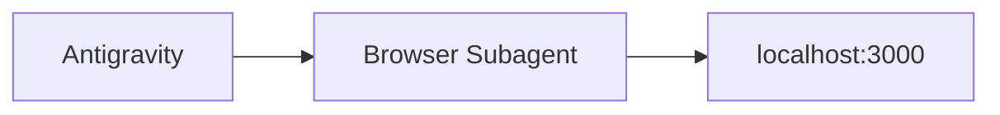
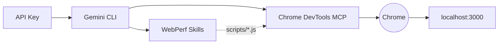

# Mòdul 01: Setup del Laboratori

El taller ofereix dos camins. Tria el que millor s'adapti al teu entorn:

| Component           | Antigravity                            | Gemini CLI                                           |
| ------------------- | -------------------------------------- | ---------------------------------------------------- |
| Autenticació        | Compte de Google (Vertex AI)           | API Key de Google AI Studio                          |
| Interfície de l'agent | IDE d'escriptori                     | Terminal (`gemini "..."`)                            |
| Accés al navegador  | Browser Subagent integrat              | Chrome DevTools MCP + `--remote-debugging-port=9222` |
| Skills              | Sense Skills (navegació nativa)        | `npx skills add`                                     |
| Model principal     | Gemini 3.1 Pro / Flash (seleccionable) | `gemini-2.0-flash`                                   |

---

## Opció A: Antigravity



### 1. Instal·lar Antigravity

Descarrega i instal·la Antigravity des de [antigravity.google/download](https://antigravity.google/download):

- **macOS**: macOS 12 (Monterey) o superior. No compatible amb X86.
- **Windows**: Windows 10 (64 bit)
- **Linux**: glibc >= 2.28, glibcxx >= 3.4.25 (Ubuntu 20, Debian 10, Fedora 36, RHEL 8)

Inicia sessió amb el teu compte de Google. Antigravity fa servir Google Vertex AI — no necessites API Key.

Verificació ràpida al panell de l'agent:

```
Respon només amb OK si estàs llest
```

### 2. App de Laboratori

```bash
npm install
node app/server.js
```

### 3. Verificació

Amb l'app activa a `localhost:3000`, escriu al panell de l'agent:

```
Navega a localhost:3000 i digues-me quant tarda a carregar la imatge principal.
```

Si l'agent obre el Browser Subagent, navega al lloc i retorna informació sobre la pàgina, l'entorn està llest.

---

## Opció B: Gemini CLI + Skills



### 1. API Key de Google AI Studio

1. Accedeix a [Google AI Studio](https://aistudio.google.com/).
2. A la barra lateral, fes clic a **"Get API key"** → **"Create API key"**.
3. Copia la clau generada.
4. A l'arrel del projecte, crea `.env.local`:
   ```bash
   GOOGLE_API_KEY=la_teva_clau_aqui
   ```

> Verifica que `.env.local` estigui al `.gitignore`.

### 2. Gemini CLI

```bash
npm install -g @google/gemini-cli
gemini auth login
```

Verificació ràpida:

```bash
gemini "Respon només amb OK si estàs llest"
```

### 3. Chrome DevTools MCP

L'MCP és el pont entre Gemini i les APIs internes de Chrome. Permet a l'agent navegar, capturar traces, injectar scripts i fer screenshots.

```bash
gemini mcp add chrome-devtools npx -y chrome-devtools-mcp@latest --autoConnect --port=9222
```

Tanca Chrome completament i obre'l amb el port de depuració:

**macOS:**

```bash
/Applications/Google\ Chrome.app/Contents/MacOS/Google\ Chrome --remote-debugging-port=9222
```

**Windows:**

```powershell
& "C:\Program Files\Google\Chrome\Application\chrome.exe" --remote-debugging-port=9222
```

**Linux:**

```bash
google-chrome --remote-debugging-port=9222
```

> Sense `--remote-debugging-port`, l'MCP llança Chrome en mode headless (invisible). Per al taller volem veure cada acció de l'agent al navegador.

Per verificar que el port està actiu, obre a Chrome:

```
chrome://inspect/#devices
```

Hauries de veure la pestanya activa llistada sota **Remote Target**. Consulta la [documentació oficial de remote debugging](https://developer.chrome.com/docs/devtools/remote-debugging) per a més detalls.

### 4. WebPerf Skills

[WebPerf Snippets](https://webperf-snippets.nucliweb.net/) és una col·lecció de scripts JavaScript per mesurar mètriques de rendiment web directament al navegador. Empaquetats com a Skills, l'agent els injecta a la pàgina i retorna els resultats. ([Més info al post](https://joanleon.dev/posts/webperf-snippets-agent-skills/))

```bash
npx -y skills add nucliweb/webperf-snippets
```

### 5. App de Laboratori

```bash
npm install
node app/server.js
```

Obre `http://localhost:3000` al Chrome que has llançat amb `--remote-debugging-port=9222`.

### 6. Verificació

```bash
gemini "Navega a localhost:3000 i mesura el LCP fent servir les webperf skills."
```

Si l'agent navega al lloc, injecta el script `LCP.js` via `evaluate_script`, i retorna un valor en mil·lisegons amb l'element identificat, l'entorn està llest.

---

## Què hi ha trencat a l'app?

Independentment del camí triat, l'app té tres problemes de rendiment intencionats:

| Problema | Element           | Causa                                                      |
| -------- | ----------------- | ---------------------------------------------------------- |
| **LCP**  | `#hero-image`     | Imatge de 4000px sense `fetchpriority` ni dimensions       |
| **CLS**  | `#dynamic-banner` | Banner injectat 1.5s després sense espai reservat          |
| **INP**  | `#inp-btn`        | Bucle bloquejant de 300ms al main thread                   |

No els arreglis manualment — l'agent ho farà.

---

**Següent pas:** Entendre què és una SKILL i per què garanteix el determinisme a `02_skills.cat.md`.
