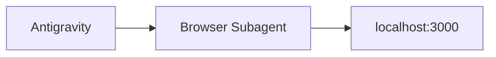
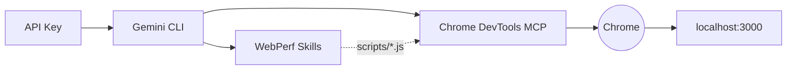

# Módulo 01: Setup del Laboratorio

El taller ofrece dos caminos. Elige el que mejor se adapte a tu entorno:

| Componente          | Antigravity                            | Gemini CLI                                           |
| ------------------- | -------------------------------------- | ---------------------------------------------------- |
| Autenticación       | Cuenta de Google (Vertex AI)           | API Key de Google AI Studio                          |
| Interfaz del agente | IDE de escritorio                      | Terminal (`gemini "..."`)                            |
| Acceso al navegador | Browser Subagent integrado             | Chrome DevTools MCP + `--remote-debugging-port=9222` |
| Skills              | Sin Skills (navegación nativa)         | `npx skills add`                                     |
| Modelo principal    | Gemini 3.1 Pro / Flash (seleccionable) | `gemini-2.0-flash`                                   |

---

## Opción A: Antigravity



### 1. Instalar Antigravity

Descarga e instala Antigravity desde [antigravity.google/download](https://antigravity.google/download):

- **macOS**: macOS 12 (Monterey) o superior. No compatible con X86.
- **Windows**: Windows 10 (64 bit)
- **Linux**: glibc >= 2.28, glibcxx >= 3.4.25 (Ubuntu 20, Debian 10, Fedora 36, RHEL 8)

Inicia sesión con tu cuenta de Google. Antigravity usa Google Vertex AI — no necesitas API Key.

Verificación rápida en el panel del agente:

```
Responde solo con OK si estás listo
```

### 2. App de Laboratorio

```bash
npm install
node app/server.js
```

### 3. Verificación

Con la app activa en `localhost:3000`, escribe en el panel del agente:

```
Navega a localhost:3000 y dime cuánto tarda en cargar la imagen principal.
```

Si el agente abre el Browser Subagent, navega al sitio y devuelve información sobre la página, el entorno está listo.

---

## Opción B: Gemini CLI + Skills



### 1. API Key de Google AI Studio

1. Accede a [Google AI Studio](https://aistudio.google.com/).
2. En la barra lateral, haz clic en **"Get API key"** → **"Create API key"**.
3. Copia la clave generada.
4. En la raíz del proyecto, crea `.env.local`:
   ```bash
   GOOGLE_API_KEY=tu_clave_aqui
   ```

> Verifica que `.env.local` esté en `.gitignore`.

### 2. Gemini CLI

```bash
npm install -g @google/gemini-cli
gemini auth login
```

Verificación rápida:

```bash
gemini "Responde solo con OK si estás listo"
```

### 3. Chrome DevTools MCP

El MCP es el puente entre Gemini y las APIs internas de Chrome. Permite al agente navegar, capturar traces, inyectar scripts y tomar screenshots.

```bash
gemini mcp add chrome-devtools npx -y chrome-devtools-mcp@latest --autoConnect --port=9222
```

Cierra Chrome completamente y ábrelo con el puerto de depuración:

**macOS:**

```bash
/Applications/Google\ Chrome.app/Contents/MacOS/Google\ Chrome --remote-debugging-port=9222
```

**Windows:**

```powershell
& "C:\Program Files\Google\Chrome\Application\chrome.exe" --remote-debugging-port=9222
```

**Linux:**

```bash
google-chrome --remote-debugging-port=9222
```

> Sin `--remote-debugging-port`, el MCP lanza Chrome en modo headless (invisible). Para el taller queremos ver cada acción del agente en el navegador.

Para verificar que el puerto está activo, abre en Chrome:

```
chrome://inspect/#devices
```

Deberías ver la pestaña activa listada bajo **Remote Target**. Consulta la [documentación oficial de remote debugging](https://developer.chrome.com/docs/devtools/remote-debugging) para más detalles.

### 4. WebPerf Skills

[WebPerf Snippets](https://webperf-snippets.nucliweb.net/) es una colección de scripts JavaScript para medir métricas de rendimiento web directamente en el navegador. Empaquetados como Skills, el agente los inyecta en la página y devuelve los resultados. ([Más info en el post](https://joanleon.dev/posts/webperf-snippets-agent-skills/))

```bash
npx -y skills add nucliweb/webperf-snippets
```

### 5. App de Laboratorio

```bash
npm install
node app/server.js
```

Abre `http://localhost:3000` en el Chrome que has lanzado con `--remote-debugging-port=9222`.

### 6. Verificación

```bash
gemini "Navega a localhost:3000 y mide el LCP usando las webperf skills."
```

Si el agente navega al sitio, inyecta el script `LCP.js` via `evaluate_script`, y devuelve un valor en milisegundos con el elemento identificado, el entorno está listo.

---

## ¿Qué hay roto en la app?

Independientemente del camino elegido, la app tiene tres problemas de rendimiento intencionados:

| Problema | Elemento          | Causa                                               |
| -------- | ----------------- | --------------------------------------------------- |
| **LCP**  | `#hero-image`     | Imagen de 4000px sin `fetchpriority` ni dimensiones |
| **CLS**  | `#dynamic-banner` | Banner inyectado 1.5s después sin espacio reservado |
| **INP**  | `#inp-btn`        | Bucle bloqueante de 300ms en el main thread         |

No los arregles manualmente — el agente lo hará.

---

**Siguiente paso:** Entender qué es una SKILL y por qué garantiza el determinismo en `02_skills.es.md`.
