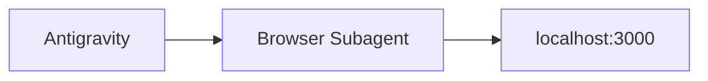
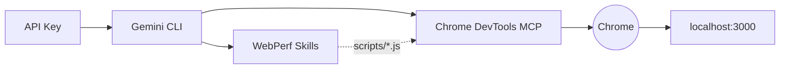

# Module 01: Lab Setup

The workshop offers two paths. Choose the one that best fits your environment:

| Component           | Antigravity                            | Gemini CLI                                           |
| ------------------- | -------------------------------------- | ---------------------------------------------------- |
| Authentication      | Google account (Vertex AI)             | Google AI Studio API Key                             |
| Agent interface     | Desktop IDE                            | Terminal (`gemini "..."`)                            |
| Browser access      | Integrated Browser Subagent            | Chrome DevTools MCP + `--remote-debugging-port=9222` |
| Skills              | No Skills (native browsing)            | `npx skills add`                                     |
| Main model          | Gemini 3.1 Pro / Flash (selectable)    | `gemini-2.0-flash`                                   |

---

## Option A: Antigravity



### 1. Install Antigravity

Download and install Antigravity from [antigravity.google/download](https://antigravity.google/download):

- **macOS**: macOS 12 (Monterey) or later. Not compatible with X86.
- **Windows**: Windows 10 (64 bit)
- **Linux**: glibc >= 2.28, glibcxx >= 3.4.25 (Ubuntu 20, Debian 10, Fedora 36, RHEL 8)

Sign in with your Google account. Antigravity uses Google Vertex AI — no API Key needed.

Quick check in the agent panel:

```
Reply with OK only if you are ready
```

### 2. Lab App

```bash
npm install
node app/server.js
```

### 3. Verification

With the app running at `localhost:3000`, type in the agent panel:

```
Navigate to localhost:3000 and tell me how long the main image takes to load.
```

If the agent opens the Browser Subagent, navigates to the site, and returns information about the page, the environment is ready.

---

## Option B: Gemini CLI + Skills



### 1. Google AI Studio API Key

1. Go to [Google AI Studio](https://aistudio.google.com/).
2. In the sidebar, click **"Get API key"** → **"Create API key"**.
3. Copy the generated key.
4. In the project root, create `.env.local`:
   ```bash
   GOOGLE_API_KEY=your_key_here
   ```

> Make sure `.env.local` is in `.gitignore`.

### 2. Gemini CLI

```bash
npm install -g @google/gemini-cli
gemini auth login
```

Quick check:

```bash
gemini "Reply with OK only if you are ready"
```

### 3. Chrome DevTools MCP

The MCP is the bridge between Gemini and Chrome's internal APIs. It allows the agent to navigate, capture traces, inject scripts, and take screenshots.

```bash
gemini mcp add chrome-devtools npx -y chrome-devtools-mcp@latest --autoConnect --port=9222
```

Close Chrome completely and open it with the debugging port:

**macOS:**

```bash
/Applications/Google\ Chrome.app/Contents/MacOS/Google\ Chrome --remote-debugging-port=9222
```

**Windows:**

```powershell
& "C:\Program Files\Google\Chrome\Application\chrome.exe" --remote-debugging-port=9222
```

**Linux:**

```bash
google-chrome --remote-debugging-port=9222
```

> Without `--remote-debugging-port`, the MCP launches Chrome in headless mode (invisible). For the workshop we want to see each agent action in the browser.

To verify the port is active, open in Chrome:

```
chrome://inspect/#devices
```

You should see the active tab listed under **Remote Target**. See the [official remote debugging documentation](https://developer.chrome.com/docs/devtools/remote-debugging) for more details.

### 4. WebPerf Skills

[WebPerf Snippets](https://webperf-snippets.nucliweb.net/) is a collection of JavaScript scripts to measure web performance metrics directly in the browser. Packaged as Skills, the agent injects them into the page and returns the results. ([More info in the post](https://joanleon.dev/posts/webperf-snippets-agent-skills/))

```bash
npx -y skills add nucliweb/webperf-snippets
```

### 5. Lab App

```bash
npm install
node app/server.js
```

Open `http://localhost:3000` in the Chrome you launched with `--remote-debugging-port=9222`.

### 6. Verification

```bash
gemini "Navigate to localhost:3000 and measure LCP using the webperf skills."
```

If the agent navigates to the site, injects the `LCP.js` script via `evaluate_script`, and returns a value in milliseconds with the identified element, the environment is ready.

---

## What Is Broken in the App?

Regardless of the chosen path, the app has three intentional performance issues:

| Issue   | Element           | Cause                                                    |
| ------- | ----------------- | -------------------------------------------------------- |
| **LCP** | `#hero-image`     | 4000px image without `fetchpriority` or dimensions       |
| **CLS** | `#dynamic-banner` | Banner injected 1.5s later with no reserved space        |
| **INP** | `#inp-btn`        | 300ms blocking loop on the main thread                   |

Do not fix them manually — the agent will do it.

---

**Next step:** Understand what a SKILL is and why it guarantees determinism in `02_skills.md`.
