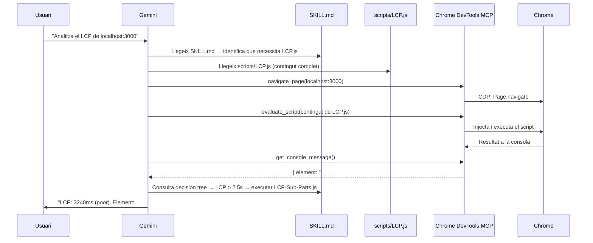
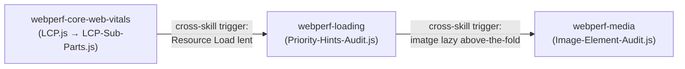

# Mòdul 02: SKILLs — El Determinisme com a Arquitectura

Una SKILL és una carpeta amb dues coses: un fitxer `SKILL.md` que l'agent llegeix, i una carpeta `scripts/` amb fitxers `.js` (en aquest cas) que l'agent injecta al navegador **sense modificar**. Aquesta separació és la base del determinisme.

## 1. El problema que resolen les SKILLs

Sense SKILLs, quan demanes a Gemini "mesura el LCP", passa això:

1. Gemini genera JavaScript des de zero basant-se en el seu coneixement de la PerformanceObserver API.
2. Cada execució pot produir codi lleugerament diferent.
3. L'LLM pot "optimitzar", reinterpretar o adaptar el codi en lloc de copiar-lo literalment.
4. Per a la mesura de rendiment, això és exactament el que **no** volem.

Amb SKILLs, l'agent llegeix `scripts/LCP.js` — un fitxer immutable, pre-validat — i l'injecta tal qual via `evaluate_script`. El resultat és idèntic en cada execució, amb qualsevol model, en qualsevol sessió.

## 2. Anatomia d'una SKILL

```
skills/webperf-core-web-vitals/
├── SKILL.md                          ← Instruccions per a l'agent
├── scripts/
│   ├── LCP.js                        ← Script que s'injecta a Chrome
│   ├── CLS.js
│   ├── INP.js
│   ├── LCP-Sub-Parts.js
│   ├── LCP-Trail.js
│   ├── LCP-Image-Entropy.js
│   └── LCP-Video-Candidate.js
└── references/
    ├── snippets.md                   ← Descripcions i llindars
    └── schema.md                     ← Esquemes dels valors de retorn
```

Tres capes, cada una amb un consumidor diferent:

| Capa              | Fitxer                | Qui la llegeix          | Funció                                                          |
| ----------------- | --------------------- | ----------------------- | --------------------------------------------------------------- |
| **Instruccions**  | `SKILL.md`            | L'agent (LLM)           | Workflows, decision trees, llindars, quan usar cada script      |
| **Codi**          | `scripts/*.js`        | El navegador (via MCP)  | Mesura pura — PerformanceObserver, LayoutShift, LoAF            |
| **Execució**      | MCP `evaluate_script` | Chrome DevTools         | Pont que injecta el `.js` i captura la sortida de la consola    |

## 3. El flux d'execució real

Quan demanes `"Analitza el LCP de localhost:3000"` amb les WebPerf Skills instal·lades:



L'agent **no genera JavaScript**. Llegeix el fitxer `.js`, el passa com a string a `evaluate_script`, i llegeix el resultat de la consola. El mateix script produeix el mateix resultat cada vegada.

## 4. Decision Trees: la intel·ligència del SKILL.md

La part més potent d'una SKILL no és el script — és l'arbre de decisions que li diu a l'agent **què fer després** d'obtenir un resultat.

Exemple del `SKILL.md` de `webperf-core-web-vitals`:

```
### After LCP.js

- If LCP > 2.5s → Run LCP-Sub-Parts.js to diagnose which phase is slow
- If LCP > 4.0s (poor) → Run full LCP deep dive workflow (5 snippets)
- If LCP candidate is an image → Run LCP-Image-Entropy.js
  and webperf-media:Image-Element-Audit.js
```

Això converteix l'agent en un sistema de regles: mesura → avalua llindar → executa el pas següent. No hi ha interpretació, hi ha lògica condicional.

## 5. Demostració amb l'app de laboratori

### LCP

```
Navega a localhost:3000 i executa la SKILL de LCP.
```

L'agent executarà `LCP.js`, obtindrà un valor > 2.5s, i el decision tree el portarà a executar `LCP-Sub-Parts.js` per desglossar les fases (TTFB, Resource Load, Render Delay). Amb aquesta informació identificarà que `#hero-image` no té `fetchpriority="high"` ni dimensions explícites.

### CLS

```
Mesura el CLS de localhost:3000 fent servir les teves webperf skills. Espera 3 segons després de carregar la pàgina.
```

L'agent executarà `CLS.js` i detectarà que `#dynamic-banner` causa un layout shift de ~0.42, molt per sobre del llindar de 0.1. El decision tree el redirigirà a verificar si hi ha imatges sense dimensions o fonts que causin FOUT.

### INP

```
Fes clic al botó #inp-btn i mesura l'INP.
```

L'agent executarà `INP.js`, farà clic al botó, i cridarà `getINP()` per obtenir la latència. Detectarà que el bucle bloquejant de 300ms excedeix el llindar de 200ms.

## 6. Cross-Skill: encadenament automàtic entre SKILLs

Les 6 SKILLs no són illes. El `SKILL.md` de cada una inclou **cross-skill triggers**: recomanacions que indiquen a l'agent quan activar una altra SKILL per aprofundir en el diagnòstic.

Exemple del `SKILL.md` de `webperf-core-web-vitals`:

```
#### From LCP to Loading Skill

- If LCP > 2.5s and TTFB phase is dominant
  → Use webperf-loading skill: TTFB.js, TTFB-Sub-Parts.js

- If LCP image is lazy-loaded
  → Use webperf-loading skill: Find-Above-The-Fold-Lazy-Loaded-Images.js

- If LCP has no fetchpriority
  → Use webperf-loading skill: Priority-Hints-Audit.js
```

Quan l'agent executa `LCP.js` i obté un valor > 2.5s, el decision tree li diu que necessita `LCP-Sub-Parts.js`. Si el desglossament revela que la fase de càrrega del recurs és lenta, el cross-skill trigger li indica que activi la SKILL `webperf-loading` i executi `Priority-Hints-Audit.js`. L'agent ho fa de forma autònoma — no cal indicar-li quina SKILL fer servir.



La meta-skill `webperf` actua com a enrutador inicial: rep la pregunta de l'usuari i apunta a la SKILL correcta segons el domini (CWV, Loading, Interaction, Media, Resources). A partir d'aquí, els cross-skill triggers guien la navegació entre SKILLs.

### Com funciona a Gemini CLI

Gemini CLI descobreix les SKILLs en iniciar la sessió: escaneja els directoris de skills i injecta el `name` i `description` de cada una al system prompt. Quan la teva pregunta encaixa amb una SKILL, l'agent l'**activa** — carrega el `SKILL.md` complet al seu context i obté accés als fitxers del directori de la SKILL.

Tot passa dins d'una única sessió, en el mateix context de l'agent. No hi ha processos separats ni aïllament de memòria. L'especialització ve dels `SKILL.md`: cada un té els seus propis scripts, decision trees i cross-skill triggers, i l'agent els segueix com a instruccions.

## 7. Resum: per què això és determinista

| Sense Skills                                         | Amb Skills                                          |
| ---------------------------------------------------- | --------------------------------------------------- |
| L'agent genera JS des del seu entrenament            | L'agent llegeix fitxers `.js` pre-validats          |
| Cada execució pot produir codi diferent              | El mateix script produeix el mateix resultat        |
| L'LLM interpreta què mesurar i com                  | El `SKILL.md` defineix què mesurar i els llindars   |
| La qualitat depèn del prompt                         | La qualitat depèn del script i el decision tree     |
| Consumeix tokens generant codi                       | Consumeix tokens només per decidir quin script usar |

---

**Següent pas:** Configurar `GEMINI.md` perquè l'agent faci servir les SKILLs amb un protocol de treball definit a `03_gemini.cat.md`.
