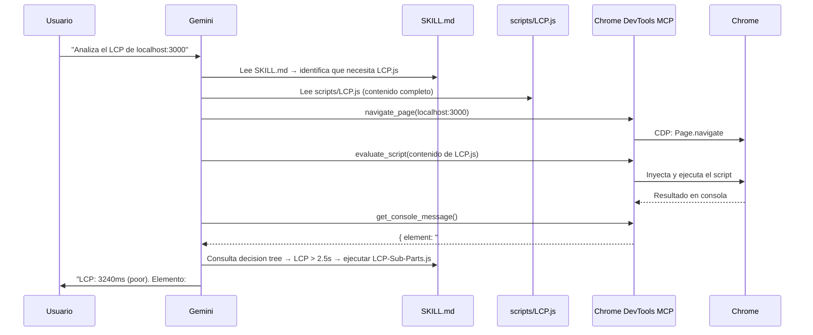
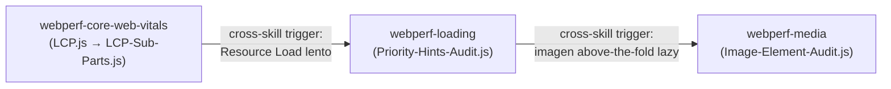

# Módulo 02: SKILLs — El Determinismo como Arquitectura

Una SKILL es una carpeta con dos cosas: un archivo `SKILL.md` que el agente lee, y una carpeta `scripts/` con archivos `.js` (en este caso) que el agente inyecta en el navegador **sin modificar**. Esa separación es la base del determinismo.

## 1. El problema que resuelven las SKILLs

Sin SKILLs, cuando pides a Gemini "mide el LCP", ocurre esto:

1. Gemini genera JavaScript desde cero basándose en su conocimiento de la PerformanceObserver API.
2. Cada ejecución puede producir código ligeramente diferente.
3. El LLM puede "optimizar", reinterpretar o adaptar el código en lugar de copiarlo literalmente.
4. Para medición de rendimiento, eso es exactamente lo que **no** queremos.

Con SKILLs, el agente lee `scripts/LCP.js` — un archivo inmutable, pre-validado — y lo inyecta tal cual via `evaluate_script`. El resultado es idéntico en cada ejecución, con cualquier modelo, en cualquier sesión.

## 2. Anatomía de una SKILL

```
skills/webperf-core-web-vitals/
├── SKILL.md                          ← Instrucciones para el agente
├── scripts/
│   ├── LCP.js                        ← Script que se inyecta en Chrome
│   ├── CLS.js
│   ├── INP.js
│   ├── LCP-Sub-Parts.js
│   ├── LCP-Trail.js
│   ├── LCP-Image-Entropy.js
│   └── LCP-Video-Candidate.js
└── references/
    ├── snippets.md                   ← Descripciones y umbrales
    └── schema.md                     ← Esquemas de los valores de retorno
```

Tres capas, cada una con un consumidor diferente:

| Capa              | Archivo               | Quién la lee           | Función                                                      |
| ----------------- | --------------------- | ---------------------- | ------------------------------------------------------------ |
| **Instrucciones** | `SKILL.md`            | El agente (LLM)        | Workflows, decision trees, umbrales, cuándo usar cada script |
| **Código**        | `scripts/*.js`        | El navegador (via MCP) | Medición pura — PerformanceObserver, LayoutShift, LoAF       |
| **Ejecución**     | MCP `evaluate_script` | Chrome DevTools        | Puente que inyecta el `.js` y captura la salida de consola   |

## 3. El flujo de ejecución real

Cuando pides `"Analiza el LCP de localhost:3000"` con las WebPerf Skills instaladas:



El agente **no genera JavaScript**. Lee el archivo `.js`, lo pasa como string a `evaluate_script`, y lee el resultado de la consola. El mismo script produce el mismo resultado cada vez.

## 4. Decision Trees: la inteligencia del SKILL.md

La parte más potente de una SKILL no es el script — es el árbol de decisiones que le dice al agente **qué hacer después** de obtener un resultado.

Ejemplo del `SKILL.md` de `webperf-core-web-vitals`:

```
### After LCP.js

- If LCP > 2.5s → Run LCP-Sub-Parts.js to diagnose which phase is slow
- If LCP > 4.0s (poor) → Run full LCP deep dive workflow (5 snippets)
- If LCP candidate is an image → Run LCP-Image-Entropy.js
  and webperf-media:Image-Element-Audit.js
```

Esto convierte al agente en un sistema de reglas: mide → evalúa umbral → ejecuta el siguiente paso. No hay interpretación, hay lógica condicional.

## 5. Demostración con la app de laboratorio

### LCP

```
Navega a localhost:3000 y ejecuta la SKILL de LCP.
```

El agente ejecutará `LCP.js`, obtendrá un valor > 2.5s, y el decision tree lo llevará a ejecutar `LCP-Sub-Parts.js` para desglosar las fases (TTFB, Resource Load, Render Delay). Con esa información identificará que `#hero-image` no tiene `fetchpriority="high"` ni dimensiones explícitas.

### CLS

```
Mide el CLS de localhost:3000 usando tus webperf skills. Espera 3 segundos después de cargar la página.
```

El agente ejecutará `CLS.js` y detectará que `#dynamic-banner` causa un layout shift de ~0.42, muy por encima del umbral de 0.1. El decision tree lo redirigirá a verificar si hay imágenes sin dimensiones o fonts que causen FOUT.

### INP

```
Haz clic en el botón #inp-btn y mide el INP.
```

El agente ejecutará `INP.js`, hará clic en el botón, y llamará a `getINP()` para obtener la latencia. Detectará que el bucle bloqueante de 300ms excede el umbral de 200ms.

## 6. Cross-Skill: encadenamiento automático entre SKILLs

Las 6 SKILLs no son islas. El `SKILL.md` de cada una incluye **cross-skill triggers**: recomendaciones que indican al agente cuándo activar otra SKILL para profundizar en el diagnóstico.

Ejemplo del `SKILL.md` de `webperf-core-web-vitals`:

```
#### From LCP to Loading Skill

- If LCP > 2.5s and TTFB phase is dominant
  → Use webperf-loading skill: TTFB.js, TTFB-Sub-Parts.js

- If LCP image is lazy-loaded
  → Use webperf-loading skill: Find-Above-The-Fold-Lazy-Loaded-Images.js

- If LCP has no fetchpriority
  → Use webperf-loading skill: Priority-Hints-Audit.js
```

Cuando el agente ejecuta `LCP.js` y obtiene un valor > 2.5s, el decision tree le dice que necesita `LCP-Sub-Parts.js`. Si el desglose revela que la fase de carga del recurso es lenta, el cross-skill trigger le indica que active la SKILL `webperf-loading` y ejecute `Priority-Hints-Audit.js`. El agente lo hace de forma autónoma — no necesitas indicarle qué SKILL usar.



La meta-skill `webperf` actúa como enrutador inicial: recibe la pregunta del usuario y apunta a la SKILL correcta según el dominio (CWV, Loading, Interaction, Media, Resources). A partir de ahí, los cross-skill triggers guían la navegación entre SKILLs.

### Cómo funciona en Gemini CLI

Gemini CLI descubre las SKILLs al arrancar la sesión: escanea los directorios de skills e inyecta el `name` y `description` de cada una en el system prompt. Cuando tu pregunta encaja con una SKILL, el agente la **activa** — carga el `SKILL.md` completo en su contexto y obtiene acceso a los archivos del directorio de la SKILL.

Todo ocurre dentro de una única sesión, en el mismo contexto del agente. No hay procesos separados ni aislamiento de memoria. La especialización viene de los `SKILL.md`: cada uno tiene sus propios scripts, decision trees y cross-skill triggers, y el agente los sigue como instrucciones.

## 7. Resumen: por qué esto es determinista

| Sin Skills                                     | Con Skills                                       |
| ---------------------------------------------- | ------------------------------------------------ |
| El agente genera JS desde su entrenamiento     | El agente lee `.js` pre-validados                |
| Cada ejecución puede producir código diferente | El mismo script produce el mismo resultado       |
| El LLM interpreta qué medir y cómo            | El `SKILL.md` define qué medir y los umbrales   |
| La calidad depende del prompt                  | La calidad depende del script y el decision tree |
| Consume tokens generando código                | Consume tokens solo para decidir qué script usar |

---

**Siguiente paso:** Configurar `GEMINI.md` para que el agente use las SKILLs con un protocolo de trabajo definido en `03_gemini.es.md`.
