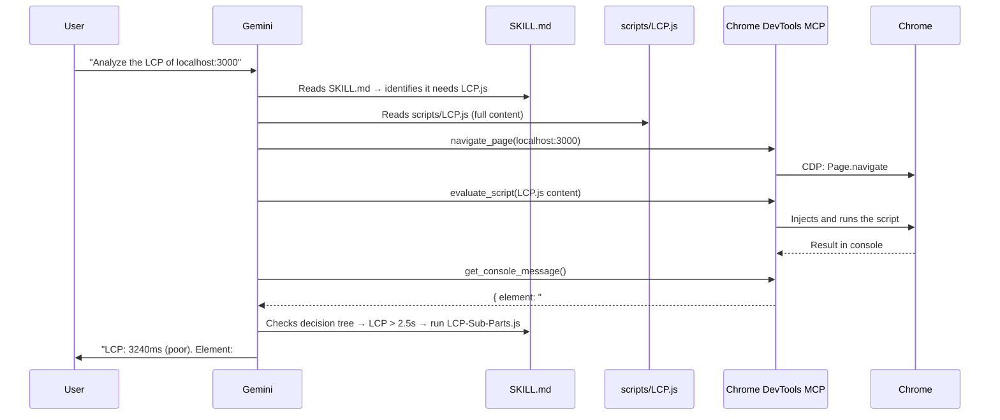
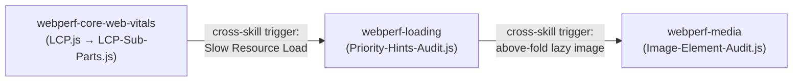

# Module 02: SKILLs — Determinism as Architecture

A SKILL is a folder with two things: a `SKILL.md` file the agent reads, and a `scripts/` folder with `.js` files (in this case) that the agent injects into the browser **without modifying them**. That separation is the foundation of determinism.

## 1. The Problem SKILLs Solve

Without SKILLs, when you ask Gemini to "measure LCP", this happens:

1. Gemini generates JavaScript from scratch based on its knowledge of the PerformanceObserver API.
2. Each run can produce slightly different code.
3. The LLM may "optimize", reinterpret, or adapt the code instead of copying it literally.
4. For performance measurement, that is exactly what we **don't** want.

With SKILLs, the agent reads `scripts/LCP.js` — an immutable, pre-validated file — and injects it as-is via `evaluate_script`. The result is identical on every run, with any model, in any session.

## 2. Anatomy of a SKILL

```
skills/webperf-core-web-vitals/
├── SKILL.md                          ← Instructions for the agent
├── scripts/
│   ├── LCP.js                        ← Script injected into Chrome
│   ├── CLS.js
│   ├── INP.js
│   ├── LCP-Sub-Parts.js
│   ├── LCP-Trail.js
│   ├── LCP-Image-Entropy.js
│   └── LCP-Video-Candidate.js
└── references/
    ├── snippets.md                   ← Descriptions and thresholds
    └── schema.md                     ← Return value schemas
```

Three layers, each with a different consumer:

| Layer             | File                  | Who reads it           | Purpose                                                         |
| ----------------- | --------------------- | ---------------------- | --------------------------------------------------------------- |
| **Instructions**  | `SKILL.md`            | The agent (LLM)        | Workflows, decision trees, thresholds, when to use each script  |
| **Code**          | `scripts/*.js`        | The browser (via MCP)  | Pure measurement — PerformanceObserver, LayoutShift, LoAF       |
| **Execution**     | MCP `evaluate_script` | Chrome DevTools        | Bridge that injects the `.js` and captures the console output   |

## 3. The Real Execution Flow

When you ask `"Analyze the LCP of localhost:3000"` with WebPerf Skills installed:



The agent **does not generate JavaScript**. It reads the `.js` file, passes it as a string to `evaluate_script`, and reads the console result. The same script produces the same result every time.

## 4. Decision Trees: the Intelligence of SKILL.md

The most powerful part of a SKILL is not the script — it's the decision tree that tells the agent **what to do next** after getting a result.

Example from the `SKILL.md` of `webperf-core-web-vitals`:

```
### After LCP.js

- If LCP > 2.5s → Run LCP-Sub-Parts.js to diagnose which phase is slow
- If LCP > 4.0s (poor) → Run full LCP deep dive workflow (5 snippets)
- If LCP candidate is an image → Run LCP-Image-Entropy.js
  and webperf-media:Image-Element-Audit.js
```

This turns the agent into a rules-based system: measure → evaluate threshold → execute next step. No interpretation — conditional logic.

## 5. Demo with the Lab App

### LCP

```
Navigate to localhost:3000 and run the LCP SKILL.
```

The agent will run `LCP.js`, get a value > 2.5s, and the decision tree will lead it to run `LCP-Sub-Parts.js` to break down the phases (TTFB, Resource Load, Render Delay). With that information it will identify that `#hero-image` has no `fetchpriority="high"` or explicit dimensions.

### CLS

```
Measure the CLS of localhost:3000 using your webperf skills. Wait 3 seconds after the page loads.
```

The agent will run `CLS.js` and detect that `#dynamic-banner` causes a layout shift of ~0.42, well above the 0.1 threshold. The decision tree will redirect it to check for images without dimensions or fonts causing FOUT.

### INP

```
Click the #inp-btn button and measure INP.
```

The agent will run `INP.js`, click the button, and call `getINP()` to get the latency. It will detect that the 300ms blocking loop exceeds the 200ms threshold.

## 6. Cross-Skill: Automatic Chaining Between SKILLs

The 6 SKILLs are not islands. Each `SKILL.md` includes **cross-skill triggers**: recommendations that tell the agent when to activate another SKILL to dig deeper.

Example from the `SKILL.md` of `webperf-core-web-vitals`:

```
#### From LCP to Loading Skill

- If LCP > 2.5s and TTFB phase is dominant
  → Use webperf-loading skill: TTFB.js, TTFB-Sub-Parts.js

- If LCP image is lazy-loaded
  → Use webperf-loading skill: Find-Above-The-Fold-Lazy-Loaded-Images.js

- If LCP has no fetchpriority
  → Use webperf-loading skill: Priority-Hints-Audit.js
```

When the agent runs `LCP.js` and gets a value > 2.5s, the decision tree tells it to run `LCP-Sub-Parts.js`. If the breakdown reveals the resource load phase is slow, the cross-skill trigger tells it to activate the `webperf-loading` SKILL and run `Priority-Hints-Audit.js`. The agent does this autonomously — you don't need to tell it which SKILL to use.



The meta-skill `webperf` acts as the initial router: it receives the user's question and points to the right SKILL based on domain (CWV, Loading, Interaction, Media, Resources). From there, cross-skill triggers guide navigation between SKILLs.

### How It Works in Gemini CLI

Gemini CLI discovers SKILLs at session startup: it scans the skills directories and injects the `name` and `description` of each one into the system prompt. When your question matches a SKILL, the agent **activates** it — loads the full `SKILL.md` into its context and gains access to the files in the SKILL's directory.

Everything happens within a single session, in the same agent context. There are no separate processes or memory isolation. Specialization comes from the `SKILL.md` files: each has its own scripts, decision trees, and cross-skill triggers, and the agent follows them as instructions.

## 7. Summary: Why This Is Deterministic

| Without Skills                                      | With Skills                                        |
| --------------------------------------------------- | -------------------------------------------------- |
| Agent generates JS from its training                | Agent reads pre-validated `.js` files              |
| Each run can produce different code                 | Same script produces same result                   |
| LLM interprets what to measure and how             | `SKILL.md` defines what to measure and thresholds  |
| Quality depends on the prompt                       | Quality depends on the script and decision tree    |
| Burns tokens generating code                        | Burns tokens only to decide which script to use    |

---

**Next step:** Configure `GEMINI.md` so the agent uses the SKILLs with a defined work protocol in `03_gemini.md`.
