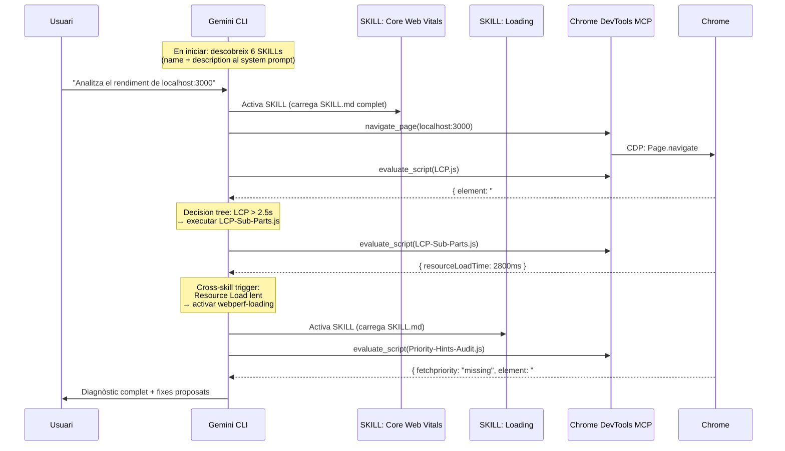

# Mòdul 04: Orquestació — El Flux Complet en Directe

Amb l'entorn muntat (Mòdul 01), les SKILLs instal·lades (Mòdul 02), i GEMINI.md configurat (Mòdul 03), un sol prompt activa tot el sistema.

## 1. Com Gemini CLI orquestra les SKILLs

Gemini CLI té un mecanisme de descobriment i activació de SKILLs que funciona de forma automàtica:

**En iniciar la sessió**, el CLI escaneja els directoris de skills (`.gemini/skills/`, `~/.gemini/skills/`) i injecta el `name` i `description` de cada SKILL al system prompt. No carrega el contingut complet — només la fitxa tècnica.

**Quan la teva pregunta encaixa** amb la descripció d'una SKILL, l'agent l'**activa**: carrega el `SKILL.md` complet al seu context i obté accés als fitxers del directori (els `scripts/*.js`).

**A partir d'aquí**, l'agent segueix els workflows, decision trees i cross-skill triggers que ha llegit. Si un trigger li indica que activi una altra SKILL, ho fa de forma autònoma.



Tot passa en una única sessió, amb un únic agent. L'especialització no ve de processos separats — ve que cada SKILL té els seus propis scripts, llindars i decision trees, i l'agent els segueix com a instruccions.

## 2. El flux real, pas a pas

### Prompt

```
Analitza el rendiment de localhost:3000.
Mesura LCP, CLS i INP fent servir les teves webperf skills.
Quan tinguis el diagnòstic, proposa els fixes i espera la meva confirmació.
```

### El que fa l'agent internament

**Fase 1 — Sense: activació de SKILLs i mesura**

| Pas | Què passa | Resultat |
|-----|-----------|----------|
| 1 | `navigate_page(localhost:3000)` | Pàgina carregada |
| 2 | Activa `webperf-core-web-vitals` (carrega SKILL.md) | Workflows i decision trees disponibles |
| 3 | Llegeix `scripts/LCP.js` → `evaluate_script(contingut)` | Injecta script a Chrome |
| 4 | `get_console_message()` | `{ element: "#hero-image", time: 3240, rating: "poor" }` |
| 5 | Llegeix `scripts/CLS.js` → `evaluate_script(contingut)` | Injecta script |
| 6 | `get_console_message()` | `{ clsValue: 0.42, sources: ["#dynamic-banner"] }` |
| 7 | `click("#inp-btn")` → `evaluate_script(INP.js)` → `getINP()` | `{ duration: 300, rating: "poor" }` |

**Fase 2 — Analyze: decision trees i cross-skill triggers**

L'agent consulta els decision trees del `SKILL.md`:

- LCP > 2.5s → executa `LCP-Sub-Parts.js` → identifica que "Resource Load Time" és alt
- Cross-skill trigger: *"If LCP has no fetchpriority → Use webperf-loading: Priority-Hints-Audit.js"*
- L'agent **activa** `webperf-loading` i executa `Priority-Hints-Audit.js` → confirma que `#hero-image` no té `fetchpriority`
- CLS > 0.1 → identifica contingut dinàmic sense espai reservat
- INP > 200ms → identifica Long Task al handler del clic

L'agent llegeix `app/public/index.html` per correlacionar les mètriques amb el codi font.

**Fase 3 — Report + Wait**

L'agent presenta:

```
## Diagnòstic de localhost:3000

### LCP: 3240ms (poor)
- Element: `img#hero-image`
- Causa: imatge de 4000px sense `fetchpriority` ni dimensions
- Fix: afegir `fetchpriority="high"` width="800" height="450"

### CLS: 0.42 (poor)
- Element: `div#dynamic-banner`
- Causa: banner injectat als 1.5s sense espai reservat
- Fix: afegir `min-height: 150px` al contenidor

### INP: 300ms (poor)
- Element: `button#inp-btn`
- Causa: bucle `while` bloquejant de 300ms al main thread
- Fix: substituir amb `setTimeout` per diferir el treball

Aplico els canvis?
```

**Fase 4 — Act (després de confirmació)**

L'usuari diu "Sí" i l'agent edita `index.html` amb els tres fixes. Després pot tornar a executar les mateixes SKILLs per verificar que els valors han millorat.

## 3. Això és multi-agent?

Conceptualment, sí. A la pràctica, depèn del que entenguem per "agent".

El que **sí** passa:
- Cada SKILL aporta un domini d'especialització diferent (CWV, Loading, Interaction, Media, Resources).
- Els decision trees i cross-skill triggers creen una **cadena d'execució automàtica** entre dominis.
- L'agent navega entre SKILLs de forma autònoma, sense que l'usuari hagi d'indicar-li quina activar.
- La meta-skill `webperf` actua com a enrutador inicial.

El que **no** passa:
- No hi ha processos separats ni aïllament de memòria.
- Tot s'executa en una única sessió amb un únic context.

L'arquitectura funciona perquè les SKILLs estan dissenyades per encadenar-se: cada `SKILL.md` sap quins scripts d'altres SKILLs recomanar segons el resultat. L'agent només ha de seguir les instruccions. Això és suficient per aconseguir un sistema d'anàlisi especialitzat per domini que es comporta com un equip d'experts — tot i que internament sigui un sol agent llegint instruccions molt ben escrites.

## 4. Demostració en directe

### Demo 1: Sense Skills, sense GEMINI.md

```
gemini "Com és el rendiment de localhost:3000?"
```

Observa: resposta conversacional, sense mesures reals, suggeriments genèrics.

### Demo 2: Amb Skills, sense GEMINI.md

```
gemini "Mesura el LCP de localhost:3000 fent servir les teves webperf skills"
```

Observa: activa la SKILL, executa el script correcte, retorna dades exactes. Però sense estructura ni protocol clar a la resposta.

### Demo 3: Amb Skills + GEMINI.md

```
gemini "Analitza el rendiment de localhost:3000"
```

Observa: segueix el protocol Sense → Analyze → Report → Wait. Encadena SKILLs automàticament via cross-skill triggers. Diagnòstic estructurat, fixes concrets, espera confirmació.

### Demo 4: El fix complet

```
Aplica els fixes i verifica que les mètriques han millorat.
```

Observa: edita el codi, torna a executar les SKILLs, confirma la millora amb dades.

El contrast entre Demo 1 i Demo 4 és la demostració del valor de tot el sistema.

---

**Taller completat.** Has passat d'una API Key a un sistema d'enginyeria autònom capaç d'auditar, diagnosticar i corregir problemes de Web Performance — amb determinisme garantit per les SKILLs, un protocol definit per `GEMINI.md`, i un flux d'orquestació que l'agent executa de forma autònoma.
