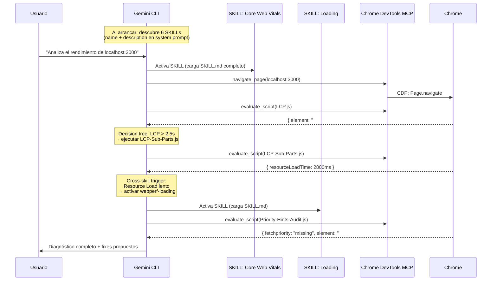

# Módulo 04: Orquestación — El Flujo Completo en Vivo

Con el entorno montado (Módulo 01), las SKILLs instaladas (Módulo 02), y GEMINI.md configurado (Módulo 03), un solo prompt activa todo el sistema.

## 1. Cómo Gemini CLI orquesta las SKILLs

Gemini CLI tiene un mecanismo de descubrimiento y activación de SKILLs que funciona de forma automática:

**Al arrancar la sesión**, el CLI escanea los directorios de skills (`.gemini/skills/`, `~/.gemini/skills/`) e inyecta el `name` y `description` de cada SKILL en el system prompt. No carga el contenido completo — solo la ficha técnica.

**Cuando tu pregunta encaja** con la descripción de una SKILL, el agente la **activa**: carga el `SKILL.md` completo en su contexto y obtiene acceso a los archivos del directorio (los `scripts/*.js`).

**A partir de ahí**, el agente sigue los workflows, decision trees y cross-skill triggers que ha leído. Si un trigger le indica que active otra SKILL, lo hace de forma autónoma.



Todo ocurre en una única sesión, con un único agente. La especialización no viene de procesos separados — viene de que cada SKILL tiene sus propios scripts, umbrales y decision trees, y el agente los sigue como instrucciones.

## 2. El flujo real, paso a paso

### Prompt

```
Analiza el rendimiento de localhost:3000.
Mide LCP, CLS e INP usando tus webperf skills.
Cuando tengas el diagnóstico, propón los fixes y espera mi confirmación.
```

### Lo que hace el agente internamente

**Fase 1 — Sense: activación de SKILLs y medición**

| Paso | Qué ocurre | Resultado |
|------|-----------|-----------|
| 1 | `navigate_page(localhost:3000)` | Página cargada |
| 2 | Activa `webperf-core-web-vitals` (carga SKILL.md) | Workflows y decision trees disponibles |
| 3 | Lee `scripts/LCP.js` → `evaluate_script(contenido)` | Inyecta script en Chrome |
| 4 | `get_console_message()` | `{ element: "#hero-image", time: 3240, rating: "poor" }` |
| 5 | Lee `scripts/CLS.js` → `evaluate_script(contenido)` | Inyecta script |
| 6 | `get_console_message()` | `{ clsValue: 0.42, sources: ["#dynamic-banner"] }` |
| 7 | `click("#inp-btn")` → `evaluate_script(INP.js)` → `getINP()` | `{ duration: 300, rating: "poor" }` |

**Fase 2 — Analyze: decision trees y cross-skill triggers**

El agente consulta los decision trees del `SKILL.md`:

- LCP > 2.5s → ejecuta `LCP-Sub-Parts.js` → identifica que "Resource Load Time" es alto
- Cross-skill trigger: *"If LCP has no fetchpriority → Use webperf-loading: Priority-Hints-Audit.js"*
- El agente **activa** `webperf-loading` y ejecuta `Priority-Hints-Audit.js` → confirma que `#hero-image` no tiene `fetchpriority`
- CLS > 0.1 → identifica contenido dinámico sin espacio reservado
- INP > 200ms → identifica Long Task en el handler del click

El agente lee `app/public/index.html` para correlacionar las métricas con el código fuente.

**Fase 3 — Report + Wait**

El agente presenta:

```
## Diagnóstico de localhost:3000

### LCP: 3240ms (poor)
- Elemento: `img#hero-image`
- Causa: imagen de 4000px sin `fetchpriority` ni dimensiones
- Fix: añadir `fetchpriority="high"` width="800" height="450"

### CLS: 0.42 (poor)
- Elemento: `div#dynamic-banner`
- Causa: banner inyectado a los 1.5s sin espacio reservado
- Fix: añadir `min-height: 150px` al contenedor

### INP: 300ms (poor)
- Elemento: `button#inp-btn`
- Causa: bucle `while` bloqueante de 300ms en el main thread
- Fix: reemplazar con `setTimeout` para diferir el trabajo

¿Aplico los cambios?
```

**Fase 4 — Act (tras confirmación)**

El usuario dice "Sí" y el agente edita `index.html` con los tres fixes. Luego puede volver a ejecutar las mismas SKILLs para verificar que los valores mejoraron.

## 3. ¿Es esto multi-agente?

Conceptualmente, sí. En la práctica, depende de qué entendamos por "agente".

Lo que **sí** ocurre:
- Cada SKILL aporta un dominio de especialización diferente (CWV, Loading, Interaction, Media, Resources).
- Los decision trees y cross-skill triggers crean una **cadena de ejecución automática** entre dominios.
- El agente navega entre SKILLs de forma autónoma, sin que el usuario tenga que indicarle cuál activar.
- La meta-skill `webperf` actúa como enrutador inicial.

Lo que **no** ocurre:
- No hay procesos separados ni aislamiento de memoria.
- Todo se ejecuta en una única sesión con un único contexto.

La arquitectura funciona porque las SKILLs están diseñadas para encadenarse: cada `SKILL.md` sabe qué scripts de otras SKILLs recomendar según el resultado. El agente solo tiene que seguir las instrucciones. Eso es suficiente para conseguir un sistema de análisis especializado por dominio que se comporta como un equipo de expertos — aunque internamente sea un solo agente leyendo instrucciones muy bien escritas.

## 4. Demostración en vivo

### Demo 1: Sin Skills, sin GEMINI.md

```
gemini "¿Cómo es el rendimiento de localhost:3000?"
```

Observa: respuesta conversacional, sin mediciones reales, sugerencias genéricas.

### Demo 2: Con Skills, sin GEMINI.md

```
gemini "Mide el LCP de localhost:3000 usando tus webperf skills"
```

Observa: activa la SKILL, ejecuta el script correcto, devuelve datos exactos. Pero sin estructura ni protocolo claro en la respuesta.

### Demo 3: Con Skills + GEMINI.md

```
gemini "Analiza el rendimiento de localhost:3000"
```

Observa: sigue el protocolo Sense → Analyze → Report → Wait. Encadena SKILLs automáticamente via cross-skill triggers. Diagnóstico estructurado, fixes concretos, espera confirmación.

### Demo 4: El fix completo

```
Aplica los fixes y verifica que las métricas mejoraron.
```

Observa: edita el código, vuelve a ejecutar las SKILLs, confirma la mejora con datos.

El contraste entre Demo 1 y Demo 4 es la demostración del valor de todo el sistema.

---

**Taller completado.** Has pasado de una API Key a un sistema de ingeniería autónomo capaz de auditar, diagnosticar y corregir problemas de Web Performance — con determinismo garantizado por las SKILLs, un protocolo definido por `GEMINI.md`, y un flujo de orquestación que el agente ejecuta de forma autónoma.
