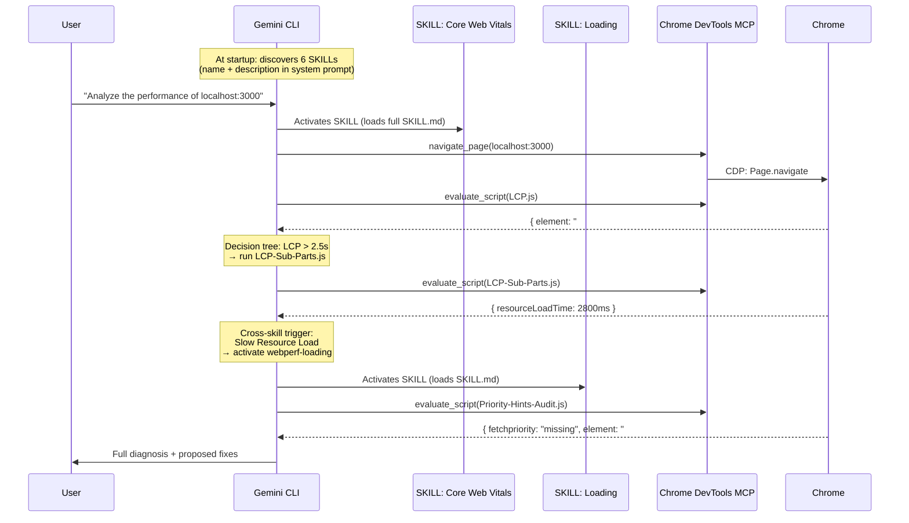

# Module 04: Orchestration — The Full Flow Live

With the environment set up (Module 01), SKILLs installed (Module 02), and GEMINI.md configured (Module 03), a single prompt activates the entire system.

## 1. How Gemini CLI Orchestrates SKILLs

Gemini CLI has an automatic SKILL discovery and activation mechanism:

**At session startup**, the CLI scans the skills directories (`.gemini/skills/`, `~/.gemini/skills/`) and injects the `name` and `description` of each SKILL into the system prompt. It does not load the full content — only the spec sheet.

**When your question matches** a SKILL's description, the agent **activates** it: loads the full `SKILL.md` into its context and gains access to the files in the directory (the `scripts/*.js`).

**From there**, the agent follows the workflows, decision trees, and cross-skill triggers it has read. If a trigger tells it to activate another SKILL, it does so autonomously.



Everything happens in a single session, with a single agent. Specialization does not come from separate processes — it comes from each SKILL having its own scripts, thresholds, and decision trees, and the agent following them as instructions.

## 2. The Real Flow, Step by Step

### Prompt

```
Analyze the performance of localhost:3000.
Measure LCP, CLS, and INP using your webperf skills.
When you have the diagnosis, propose the fixes and wait for my confirmation.
```

### What the Agent Does Internally

**Phase 1 — Sense: SKILL activation and measurement**

| Step | What happens | Result |
|------|-------------|--------|
| 1 | `navigate_page(localhost:3000)` | Page loaded |
| 2 | Activates `webperf-core-web-vitals` (loads SKILL.md) | Workflows and decision trees available |
| 3 | Reads `scripts/LCP.js` → `evaluate_script(content)` | Injects script into Chrome |
| 4 | `get_console_message()` | `{ element: "#hero-image", time: 3240, rating: "poor" }` |
| 5 | Reads `scripts/CLS.js` → `evaluate_script(content)` | Injects script |
| 6 | `get_console_message()` | `{ clsValue: 0.42, sources: ["#dynamic-banner"] }` |
| 7 | `click("#inp-btn")` → `evaluate_script(INP.js)` → `getINP()` | `{ duration: 300, rating: "poor" }` |

**Phase 2 — Analyze: decision trees and cross-skill triggers**

The agent consults the `SKILL.md` decision trees:

- LCP > 2.5s → runs `LCP-Sub-Parts.js` → identifies "Resource Load Time" is high
- Cross-skill trigger: *"If LCP has no fetchpriority → Use webperf-loading: Priority-Hints-Audit.js"*
- Agent **activates** `webperf-loading` and runs `Priority-Hints-Audit.js` → confirms `#hero-image` has no `fetchpriority`
- CLS > 0.1 → identifies dynamic content with no reserved space
- INP > 200ms → identifies Long Task in the click handler

The agent reads `app/public/index.html` to correlate metrics with source code.

**Phase 3 — Report + Wait**

The agent presents:

```
## Diagnosis of localhost:3000

### LCP: 3240ms (poor)
- Element: `img#hero-image`
- Cause: 4000px image without `fetchpriority` or dimensions
- Fix: add `fetchpriority="high"` width="800" height="450"

### CLS: 0.42 (poor)
- Element: `div#dynamic-banner`
- Cause: banner injected at 1.5s with no reserved space
- Fix: add `min-height: 150px` to the container

### INP: 300ms (poor)
- Element: `button#inp-btn`
- Cause: blocking `while` loop of 300ms on the main thread
- Fix: replace with `setTimeout` to defer the work

Shall I apply the changes?
```

**Phase 4 — Act (after confirmation)**

The user says "Yes" and the agent edits `index.html` with the three fixes. It can then re-run the same SKILLs to verify the values improved.

## 3. Is This Multi-Agent?

Conceptually, yes. In practice, it depends on what we mean by "agent".

What **does** happen:
- Each SKILL brings a different domain of specialization (CWV, Loading, Interaction, Media, Resources).
- Decision trees and cross-skill triggers create an **automatic execution chain** between domains.
- The agent navigates between SKILLs autonomously, without the user needing to say which one to activate.
- The meta-skill `webperf` acts as the initial router.

What does **not** happen:
- There are no separate processes or memory isolation.
- Everything runs in a single session with a single context.

The architecture works because SKILLs are designed to chain: each `SKILL.md` knows which scripts from other SKILLs to recommend based on the result. The agent only has to follow the instructions. That is enough to build a domain-specialized analysis system that behaves like a team of experts — even though internally it is a single agent reading very well-written instructions.

## 4. Live Demo

### Demo 1: No Skills, no GEMINI.md

```
gemini "What is the performance of localhost:3000?"
```

Observe: conversational response, no real measurements, generic suggestions.

### Demo 2: With Skills, no GEMINI.md

```
gemini "Measure the LCP of localhost:3000 using your webperf skills"
```

Observe: activates the SKILL, runs the right script, returns exact data. But without clear structure or protocol in the response.

### Demo 3: With Skills + GEMINI.md

```
gemini "Analyze the performance of localhost:3000"
```

Observe: follows the Sense → Analyze → Report → Wait protocol. Chains SKILLs automatically via cross-skill triggers. Structured diagnosis, concrete fixes, waits for confirmation.

### Demo 4: The Full Fix

```
Apply the fixes and verify that the metrics improved.
```

Observe: edits the code, re-runs the SKILLs, confirms improvement with data.

The contrast between Demo 1 and Demo 4 is the demonstration of the value of the entire system.

---

**Workshop complete.** You have gone from an API Key to an autonomous engineering system capable of auditing, diagnosing, and fixing Web Performance issues — with determinism guaranteed by SKILLs, a protocol defined by `GEMINI.md`, and an orchestration flow that the agent executes autonomously.
