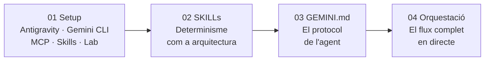

# Sistemes d'Agents Deterministes: Orquestrant Gemini amb SKILLs i Chrome DevTools

![Build [>] debug & deploy with AI](./assets/geminicli.png)

<div align="center">

[English](./README.md) · [Español](./README.es.md)

</div>

Material tècnic del taller sobre **Sistemes d'Agents Deterministes**. L'objectiu és passar de "xerrar amb la IA" a construir un sistema d'execució autònoma capaç d'auditar, diagnosticar i corregir problemes de Web Performance.

## Pilars del taller

1. **SKILLs ([WebPerf Snippets](https://github.com/nucliweb/webperf-snippets)):** Scripts pre-validats i immutables que l'agent injecta al navegador per obtenir mètriques exactes. L'agent no genera codi — executa fitxers `.js` que produeixen el mateix resultat cada vegada.
2. **GEMINI.md:** El fitxer que defineix el protocol de l'agent: quines eines fer servir, en quin ordre, i quan esperar confirmació abans d'actuar.
3. **Orquestració automàtica:** Les SKILLs s'encadenen entre elles via decision trees i cross-skill triggers. L'agent navega entre dominis d'especialització (CWV → Loading → Media) de forma autònoma, sense intervenció manual.

## Estructura del taller



1. [**01_setup.cat.md**](./01_setup.cat.md): Dues opcions d'entorn — Antigravity (sense Skills, navegació nativa) o Gemini CLI amb Chrome DevTools MCP, WebPerf Skills i app de laboratori.
2. [**02_skills.cat.md**](./02_skills.cat.md): Què és una SKILL, anatomia (`SKILL.md` + `scripts/*.js`), decision trees, i per què garanteixen el determinisme.
3. [**03_gemini.cat.md**](./03_gemini.cat.md): Què és `GEMINI.md`, com connecta Skills + MCP + protocol de treball (Sense → Analyze → Report → Wait).
4. [**04_orchestration.cat.md**](./04_orchestration.cat.md): El flux complet en directe amb l'app de laboratori. Demos progressives: sense Skills → amb Skills → amb Skills + GEMINI.md.

## Stack tècnic

- **Model:** `gemini-2.0-flash` (via Google Cloud).
- **Orquestrador:** Gemini CLI amb `GEMINI.md`.
- **Skills:** [WebPerf Snippets](https://github.com/nucliweb/webperf-snippets) — 47 scripts en 6 skills.
- **Braç executor:** Chrome DevTools MCP.
- **Entorn:** Local (macOS/Linux/Windows).

## Inici ràpid

**Opció A — Antigravity** (sense Skills): instal·la [Antigravity](https://antigravity.google/download), engega l'app i comença des del panell de l'agent.

**Opció B — Gemini CLI** (amb Skills):

```bash
# 1. Instal·la dependències i engega l'app de laboratori
npm install
node app/server.js
# → http://localhost:3000

# 2. Instal·la WebPerf Skills
npx -y skills add nucliweb/webperf-snippets

# 3. Configura Chrome DevTools MCP
gemini mcp add chrome-devtools npx -y chrome-devtools-mcp@latest --autoConnect --port=9222
```

Segueix els mòduls en ordre numèric. Cada un construeix sobre l'anterior.

## Recursos

- [gemini-agent-skills a GitHub](https://github.com/nucliweb/gemini-agent-skills)
- [Aprèn Core Web Vitals](https://web.dev/explore/learn-core-web-vitals)
- [Treo Site Speed](https://treo.sh/sitespeed)
- [CrUX Vis](https://cruxvis.withgoogle.com/)
- [Documentació Chrome DevTools](https://developer.chrome.com/docs/devtools)
- [Chrome DevTools MCP](https://developer.chrome.com/blog/chrome-devtools-mcp)
- [Agent Skills](https://agentskills.io/)
- [WebPerf Snippets](https://webperf-snippets.nucliweb.net/)
- [Performance DevTools @ Nerdearla](https://slides.com/joanleon/performance-devtools-nerdearla/)
- [Model Context Protocol](https://modelcontextprotocol.io/docs/getting-started/intro)
- [Skills.sh](https://skills.sh/)
- [WebPerf Snippets Agent Skills (Blog)](https://joanleon.dev/posts/webperf-snippets-agent-skills/)

## Sobre mi

[](https://slides.com/joanleon/about)

---

**Autor:** [Joan León](https://joanleon.dev)
**Taller:** Sistemes d'Agents Deterministes (2026)
