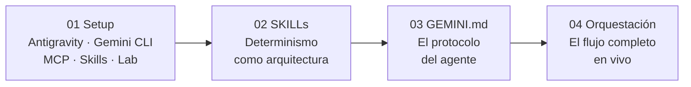

# Sistemas de Agentes Deterministas: Orquestando Gemini con SKILLs y Chrome DevTools

![Build [>] debug & deploy with AI](./assets/geminicli.png)

<div align="center">

[English](./README.md) · [Català](./README.cat.md)

</div>

Material técnico del taller sobre **Sistemas de Agentes Deterministas**. El objetivo es pasar de "chatear con la IA" a construir un sistema de ejecución autónoma capaz de auditar, diagnosticar y corregir problemas de Web Performance.

## Pilares del taller

1. **SKILLs ([WebPerf Snippets](https://github.com/nucliweb/webperf-snippets)):** Scripts pre-validados e inmutables que el agente inyecta en el navegador para obtener métricas exactas. El agente no genera código — ejecuta archivos `.js` que producen el mismo resultado cada vez.
2. **GEMINI.md:** El archivo que define el protocolo del agente: qué herramientas usar, en qué orden, y cuándo esperar confirmación antes de actuar.
3. **Orquestación automática:** Las SKILLs se encadenan entre sí via decision trees y cross-skill triggers. El agente navega entre dominios de especialización (CWV → Loading → Media) de forma autónoma, sin intervención manual.

## Estructura del taller



1. [**01_setup.es.md**](./01_setup.es.md): Dos opciones de entorno — Antigravity (sin Skills, navegación nativa) o Gemini CLI con Chrome DevTools MCP, WebPerf Skills y app de laboratorio.
2. [**02_skills.es.md**](./02_skills.es.md): Qué es una SKILL, anatomía (`SKILL.md` + `scripts/*.js`), decision trees, y por qué garantizan el determinismo.
3. [**03_gemini.es.md**](./03_gemini.es.md): Qué es `GEMINI.md`, cómo conecta Skills + MCP + protocolo de trabajo (Sense → Analyze → Report → Wait).
4. [**04_orchestration.es.md**](./04_orchestration.es.md): El flujo completo en vivo con la app de laboratorio. Demos progresivas: sin Skills → con Skills → con Skills + GEMINI.md.

## Stack técnico

- **Modelo:** `gemini-2.0-flash` (vía Google Cloud).
- **Orquestador:** Gemini CLI con `GEMINI.md`.
- **Skills:** [WebPerf Snippets](https://github.com/nucliweb/webperf-snippets) — 47 scripts en 6 skills.
- **Brazo ejecutor:** Chrome DevTools MCP.
- **Entorno:** Local (macOS/Linux/Windows).

## Inicio rápido

**Opción A — Antigravity** (sin Skills): instala [Antigravity](https://antigravity.google/download), levanta la app y empieza desde el panel del agente.

**Opción B — Gemini CLI** (con Skills):

```bash
# 1. Instala dependencias y levanta la app de laboratorio
npm install
node app/server.js
# → http://localhost:3000

# 2. Instala WebPerf Skills
npx -y skills add nucliweb/webperf-snippets

# 3. Configura Chrome DevTools MCP
gemini mcp add chrome-devtools npx -y chrome-devtools-mcp@latest --autoConnect --port=9222
```

Sigue los módulos en orden numérico. Cada uno construye sobre el anterior.

## Recursos

- [gemini-agent-skills en GitHub](https://github.com/nucliweb/gemini-agent-skills)
- [Aprende Core Web Vitals](https://web.dev/explore/learn-core-web-vitals)
- [Treo Site Speed](https://treo.sh/sitespeed)
- [CrUX Vis](https://cruxvis.withgoogle.com/)
- [Documentación Chrome DevTools](https://developer.chrome.com/docs/devtools)
- [Chrome DevTools MCP](https://developer.chrome.com/blog/chrome-devtools-mcp)
- [Agent Skills](https://agentskills.io/)
- [WebPerf Snippets](https://webperf-snippets.nucliweb.net/)
- [Performance DevTools @ Nerdearla](https://slides.com/joanleon/performance-devtools-nerdearla/)
- [Model Context Protocol](https://modelcontextprotocol.io/docs/getting-started/intro)
- [Skills.sh](https://skills.sh/)
- [WebPerf Snippets Agent Skills (Blog)](https://joanleon.dev/posts/webperf-snippets-agent-skills/)

## Sobre mí

[](https://slides.com/joanleon/about)

---

**Autor:** [Joan León](https://joanleon.dev)
**Taller:** Sistemas de Agentes Deterministas (2026)
