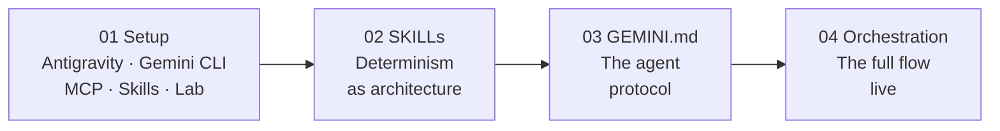
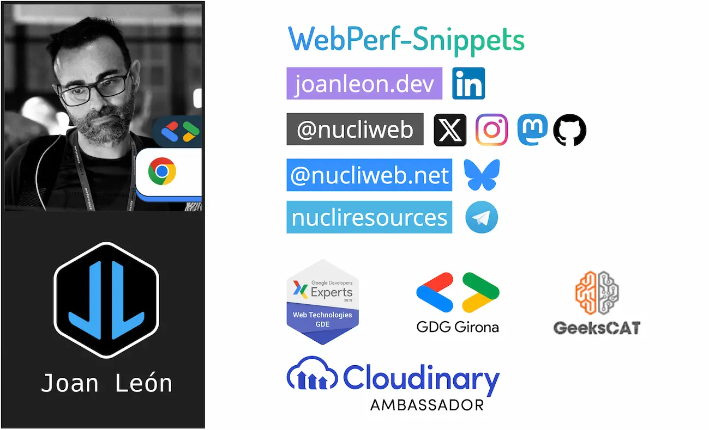

# Deterministic Agent Systems: Orchestrating Gemini with SKILLs and Chrome DevTools

![Build [>] debug & deploy with AI](./assets/geminicli.png)

<div align="center">

[Español](./README.es.md) · [Català](./README.cat.md)

</div>

Technical material for the workshop on **Deterministic Agent Systems**. The goal is to move from "chatting with AI" to building an autonomous execution system capable of auditing, diagnosing, and fixing Web Performance issues.

## Workshop Pillars

1. **SKILLs ([WebPerf Snippets](https://github.com/nucliweb/webperf-snippets)):** Pre-validated, immutable scripts that the agent injects into the browser to get exact metrics. The agent does not generate code — it executes `.js` files that produce the same result every time.
2. **GEMINI.md:** The file that defines the agent's protocol: which tools to use, in what order, and when to wait for confirmation before acting.
3. **Automatic orchestration:** SKILLs chain together via decision trees and cross-skill triggers. The agent navigates between specialization domains (CWV → Loading → Media) autonomously, without manual intervention.

## Workshop Structure



1. [**01_setup.md**](./01_setup.md): Two environment options — Antigravity (no Skills, native browsing) or Gemini CLI with Chrome DevTools MCP, WebPerf Skills, and lab app.
2. [**02_skills.md**](./02_skills.md): What a SKILL is, anatomy (`SKILL.md` + `scripts/*.js`), decision trees, and why they guarantee determinism.
3. [**03_gemini.md**](./03_gemini.md): What `GEMINI.md` is, how it connects Skills + MCP + work protocol (Sense → Analyze → Report → Wait).
4. [**04_orchestration.md**](./04_orchestration.md): The full flow live with the lab app. Progressive demos: without Skills → with Skills → with Skills + GEMINI.md.

## Tech Stack

- **Model:** `gemini-2.0-flash` (via Google Cloud).
- **Orchestrator:** Gemini CLI with `GEMINI.md`.
- **Skills:** [WebPerf Snippets](https://github.com/nucliweb/webperf-snippets) — 47 scripts in 6 skills.
- **Executor:** Chrome DevTools MCP.
- **Environment:** Local (macOS/Linux/Windows).

## Quick Start

**Option A — Antigravity** (no Skills): install [Antigravity](https://antigravity.google/download), start the app, and begin from the agent panel.

**Option B — Gemini CLI** (with Skills):

```bash
# 1. Install dependencies and start the lab app
npm install
node app/server.js
# → http://localhost:3000

# 2. Install WebPerf Skills
npx -y skills add nucliweb/webperf-snippets

# 3. Configure Chrome DevTools MCP
gemini mcp add chrome-devtools npx -y chrome-devtools-mcp@latest --autoConnect --port=9222
```

Follow the modules in numerical order. Each one builds on the previous.

## About me

[](https://slides.com/joanleon/about)

---

**Author:** [Joan León](https://joanleon.dev)
**Workshop:** Deterministic Agent Systems (2026)
